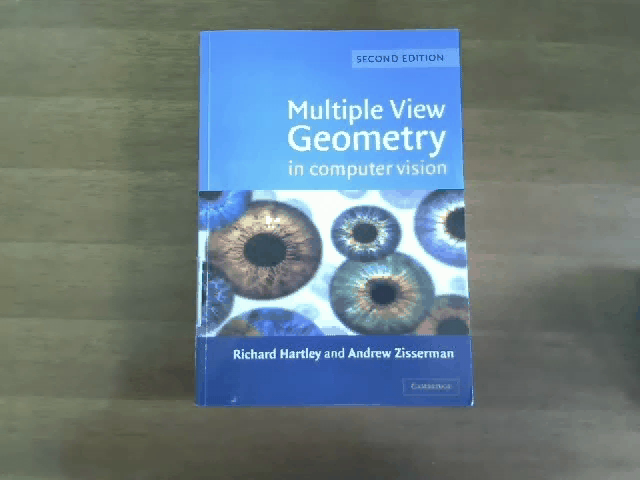
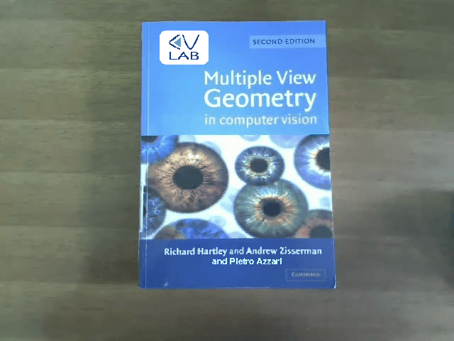

# [Augmented Reality project](https://www.unibo.it/en/teaching/course-unit-catalogue/course-unit/2023/467993)
*Project in the course 73302 at [The University of Bologna](https://www.unibo.it/en/)*

As a part of my master's degree in cybernetics and robotics, I spent one semester abroad in Bologna, Italy in the autumn of 2023.

This individual project was a mandatory part of a course in computer vision and image processing. The project consisted of writing a script able to take in a video of a book and producing a new video with a given augmented layer placed on top, using the [OpenCV](https://opencv.org/) Python library. The original video's camera trajectory has translations and rotations, as well as slow and rapid brightness changes.

Two solutions were developed; one using Frame-to-reference transformations (output_F2R.avi), and one using frame-to-frame transformations (output_F2F.avi). Both solutions use a pre-trained CNN model for text recognition from [Keras OCR](https://keras-ocr.readthedocs.io/en/latest/).

 

  
&nbsp; &nbsp; &nbsp; &nbsp;
  

  &emsp;&emsp;&emsp;Original video &emsp;&emsp;&emsp;&emsp;&emsp;&emsp;&emsp;&emsp;&emsp;&emsp;&emsp;&emsp;&emsp;&emsp;&emsp;&emsp;&emsp;&emsp;&emsp;&emsp;&emsp; Augmented video

 

### Sources:
- [OpenCV](https://opencv.org/)
- [Remove Text from Images using CV2 and Keras-OCR](https://towardsdatascience.com/remove-text-from-images-using-cv2-and-keras-ocr-24e7612ae4f4)
